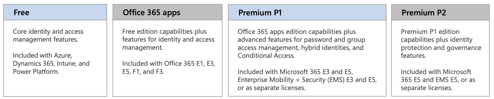
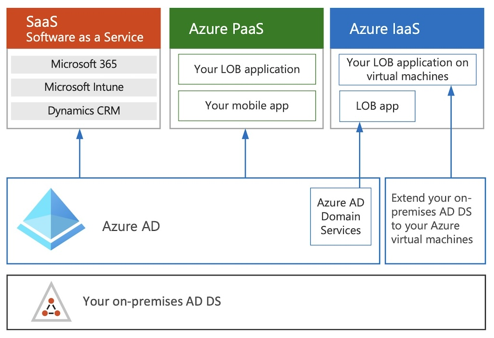

`## Manage Identity and Access (25–30%)

Section | Exam Objective     |  
------- | ------------------ |  
**1.1** | [**Manage Microsoft Entra identities**](#11---manage-microsoft-entra-identities)  
**1.2** | [**Manage Manage Microsoft Entra authentication**](#12---manage-manage-microsoft-entra-authentication) |  
**1.3** | [**Manage Microsoft Entra authorization**](#13---manage-microsoft-entra-authorization) |  
**1.4** | [**Manage Microsoft Entra application access**](#14---manage-microsoft-entra-application-access) |  

 

[Microsoft Entra ID documentation](https://learn.microsoft.com/en-us/entra/identity/)  

[Poster - Microsoft Cloud Identity for Enterprise Architects](https://learn.microsoft.com/en-us/microsoft-365/solutions/cloud-architecture-models?view=o365-worldwide#microsoft-cloud-identity-for-it-architects)  

 

---  
## **1.1 - Manage Microsoft Entra identities**

Section | Exam Objective     |  
------- | ------------------ |  
| | Secure Microsoft Entra users |  
| | Secure Microsoft Entra groups |  
| | Recommend when to use external identities |  
| | Secure external identities |  
| | Implement Microsoft Entra ID Protection |  
  
Microsoft Entra ID  

Azure AD licenses  

Azure AD vs AD DS  

### Security Principals  
2 main types of principals:
- **User Principal** representing people 
  - Guests
  - Cloud-Only users
  - Directory-Synced Users
- **Service Principal** representing an Application or Service
- **Device principal** (not the focus of this exam)  

### Users
Types of Users:
- Internal member  
- Internal guest  
- External member  
- External guest  
  

### Groups 
- Used to manage security principals at scale   
- Both Azure Entra ID and AD DS groups can co-exist in your tenant  

2 types of Groups:  
- [x] **Security Groups**:  
  - Users  
  - Services Principals  
  - nested Security Groups  
- [x] **MS 365 Groups** (for MS365 collaboration)
  - Users (only)

### Dynamic Groups 
Group membership **based on properties**  
Using Membership **rules**
Group owners cannot modify group memberships  
Only Group Admins can manage dynamic membership 
Only users can be a member of a security group with the dynamic user membership type  

***Limitations***:
- Entra ID P1 license required  
- Service Principals cannot be members  
- MS365 Dynamic Groups cannot contain devices  
- Cannot mix membership, either:  
  - Dynamic User  
  or  
  - Dynamic Device  
- Deleted MS365 Groups are retained for 30 days  
- Deleted Security Groups are NOT retained  

### Service Principals
For applications only
- **App Registration** --> Service Principal --> Roles & Permissions
  - MS does NOT manage the credentials 
  - Bt default, any member user can register an application they own
- **Managed Identity** 
  - another Azure or on-prem resource
  - MS manages the credentials 
  - System-Assigned: only 1 single Azure resource
  - User-Assigned: many to many resources

Authentication:
- Password-based  
- Certificate-based 

Roles:
- Application Developper = your app
- Cloud Application Administrator = ALL apps ! 
- Application Administrator = Application Proxy  

### MS Entra External ID  

  

- [x] B2B Business to Business  
- [x] B2C Business to Consumer  

B2B Collaboration 
- Partner using own identity solution  
- Enabled by default
- No need to manage external accounts & passwords  
- No need to sync accounts
- Self-service sign-up cannot be used with MS apps 

B2C Collaboration  
- Any SAML IdP  
- B2C Members are created in a separate dedicated B2C tenant  
- External identities licenses are shared with B2B users  
- B2C users cannot be useed to access MS resources secured by your Entra ID tenant  

### Exam tips:

**Azure AD Premium P1** is required to use:
- [x] Azure AD Application Proxy
- [x] Dynamic Groups
- [x] Password Writeback
- [x] Conditional Access 
- [x] Password Protection

**Azure AD Premium P2** is required to use:
- [x] Identity Protection
- [x] Access Reviews
- [x] Just-in-Time Access Management
  
 

---   

## **1.2 - Manage Manage Microsoft Entra authentication** 

Section | Exam Objective     |  
------- | ------------------ |  
| | Implement multi-factor authentication (MFA)
| | Configure Microsoft Entra Verified ID
| | Implement passwordless authentication
| | Implement password protection
| | Implement single sign-on (SSO)
| | Integrate single sign on (SSO) and identity providers
| | Recommend and enforce modern authentication methods

### MFA  
Security Defaults = security baseline for all users
14 days to activate MFA after 1st login

  

Premium P1: Conditional Access
Premium P2: Risk-based Conditional Access 

### Verified ID  
decentralized ID

### Passwordless  

### Password Protection  

### SSO 

---   

## **1.3 - Manage Microsoft Entra authorization**

Section | Exam Objective     |  
------- | ------------------ |  
| | Configure Azure role permissions for management groups, subscriptions, resource groups, and resources
| | Assign Microsoft Entra built-in roles
| | Assign Azure built-in roles
| | Create and assign custom roles, including Azure roles and Microsoft Entra roles
| | Implement and manage Microsoft Entra Permissions Management
| | Configure Microsoft Entra Privileged Identity Management
| | Configure role management and access reviews in Microsoft Entra
| | Implement Conditional Access policies

### Conditional Access
"if, then" policies

---   
## **1.4 - Manage Microsoft Entra application access**

Section | Exam Objective     |  
------- | ------------------ |  
| | Manage access to enterprise applications in Microsoft Entra ID, including OAuth permission grants
| | Manage Microsoft Entra app registrations
| | Configure app registration permission scopes
| | Manage app registration permission consent
| | Manage and use service principals
| | Manage managed identities for Azure resources
| | Recommend when to use and configure an Microsoft Entra Application Proxy, including authentication

<!-- ## Exam Objectives - LEGACY

| Section | Exam Objective     |  Documentation   | Tutorial  |
| ------- | ------------------ |  --------------- | --------- | 
**1** | **Manage Identity and Access** (5 Modules)
| 1.1  | Secure Azure solutions with Azure Active Directory (12 Units)
| 1.2  | Implement Hybrid identity (10 Units)
| 1.3  | Deploy Azure AD identity protection (14 Units)
| 1.4  | Configure Azure AD privileged identity management (11 Units)
| 1.5  | Design an enterprise governance strategy (14 Units)
 -->

---  
