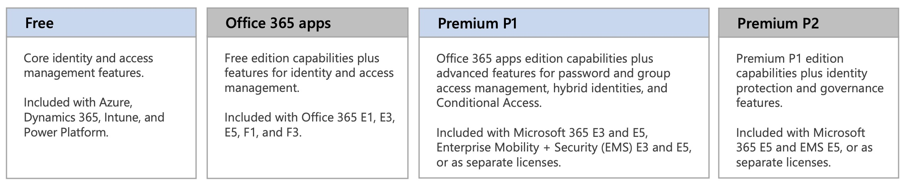

## Part 1 - Manage Identity and Access (25–30%)

Section | Exam Objective     |  
------- | ------------------ |  
**1.1** | [**Manage Microsoft Entra identities**](#11---manage-microsoft-entra-identities)  
**1.2** | [**Manage Manage Microsoft Entra authentication**](#12--manage-manage-microsoft-entra-authentication) |  
**1.3** | [**Manage Microsoft Entra authorization**](#13--manage-microsoft-entra-authorization) |  
**1.4** | [**Manage Microsoft Entra application access**](#14---manage-microsoft-entra-application-access) |  

[Poster - Microsoft Cloud Identity for Enterprise Architects](https://learn.microsoft.com/en-us/microsoft-365/solutions/cloud-architecture-models?view=o365-worldwide#microsoft-cloud-identity-for-it-architects)  

---  

## **1.1** - **Manage Microsoft Entra identities**

Section | Exam Objective     |  
------- | ------------------ |  
| | Secure Microsoft Entra users |  
| | Secure Microsoft Entra groups |  
| | Recommend when to use external identities |  
| | Secure external identities |  
| | Implement Microsoft Entra ID Protection |  
  
Microsoft Entra ID  

Azure AD Editions  

Azure AD vs AD DS  

### Exam tips:

**Azure AD Premium P1** is required to use:
- [x] Azure AD Application Proxy
- [x] Dynamic Groups
- [x] Password Writeback
- [x] Conditional Access 
- [x] Password Protection

**Azure AD Premium P2** is required to use:
- [x] Identity Protection
- [x] Access Reviews
- [x] Just-in-Time Access Management
  

---   

## **1.2** - **Manage Manage Microsoft Entra authentication** 

Section | Exam Objective     |  
------- | ------------------ |  
| | Implement multi-factor authentication (MFA)
| | Configure Microsoft Entra Verified ID
| | Implement passwordless authentication
| | Implement password protection
| | Implement single sign-on (SSO)
| | Integrate single sign on (SSO) and identity providers
| | Recommend and enforce modern authentication methods

---   

## **1.3** - **Manage Microsoft Entra authorization**

Section | Exam Objective     |  
------- | ------------------ |  
| | Configure Azure role permissions for management groups, subscriptions, resource groups, and resources
| | Assign Microsoft Entra built-in roles
| | Assign Azure built-in roles
| | Create and assign custom roles, including Azure roles and Microsoft Entra roles
| | Implement and manage Microsoft Entra Permissions Management
| | Configure Microsoft Entra Privileged Identity Management
| | Configure role management and access reviews in Microsoft Entra
| | Implement Conditional Access policies

---   
## **1.4** - **Manage Microsoft Entra application access**

Section | Exam Objective     |  
------- | ------------------ |  
| | Manage access to enterprise applications in Microsoft Entra ID, including OAuth permission grants
| | Manage Microsoft Entra app registrations
| | Configure app registration permission scopes
| | Manage app registration permission consent
| | Manage and use service principals
| | Manage managed identities for Azure resources
| | Recommend when to use and configure an Microsoft Entra Application Proxy, including authentication

<!-- ## Exam Objectives - LEGACY

| Section | Exam Objective     |  Documentation   | Tutorial  |
| ------- | ------------------ |  --------------- | --------- | 
**1** | **Manage Identity and Access** (5 Modules)
| 1.1  | Secure Azure solutions with Azure Active Directory (12 Units)
| 1.2  | Implement Hybrid identity (10 Units)
| 1.3  | Deploy Azure AD identity protection (14 Units)
| 1.4  | Configure Azure AD privileged identity management (11 Units)
| 1.5  | Design an enterprise governance strategy (14 Units)
 -->

---  
